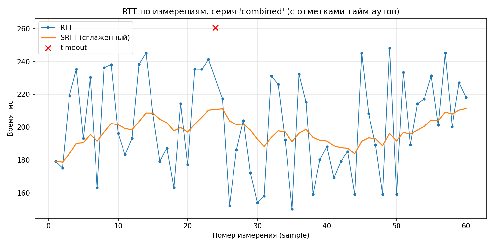
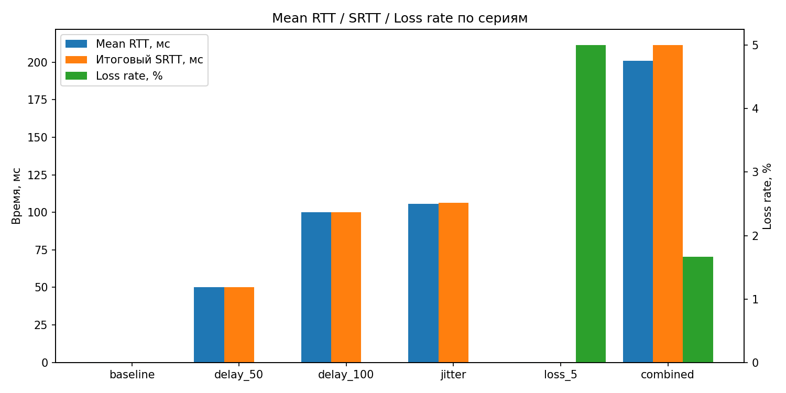
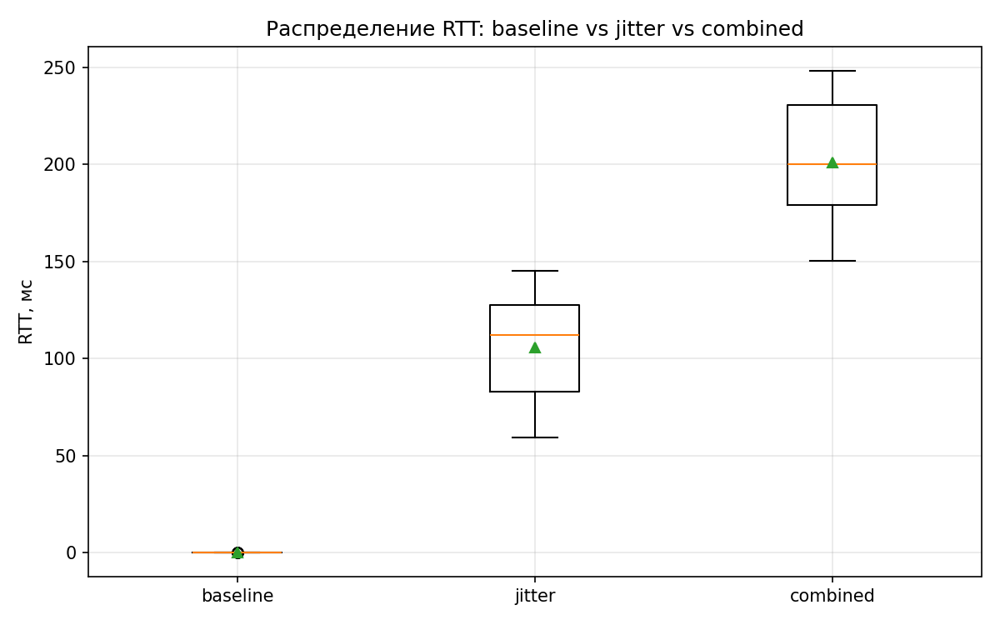

# Latency Report — ПР №2 (телеметрия UDP)

Все цифры в этом отчёте получены из РЕАЛЬНОГО прогона (не смоделированы
вручную): `run_experiments.sh` поднимает `pong_server_app` и
`ping_client_app` по локальному UDP (`127.0.0.1:27016`), по 60 PING на
серию, и дописывает результаты в `docs/latency_samples.csv`.
`analysis/analyze_latency.py` считает статистику по этому CSV независимо
от C++ (`telemetry::ComputeSeriesStats`) — оба расчёта используют одни и
те же формулы из задания и на тестовых данных дают совпадающий результат
(см. `tests/test_telemetry.cpp`), поэтому таблица ниже воспроизводима и
из C++, и из Python.

Параметры окружения, флаги и seed'ы каждой серии — см.
[`Experiment_Config.md`](./Experiment_Config.md).

## Сводная таблица по сериям

| Серия | Отправлено | Получено | Тайм-аутов | Loss rate, % | min RTT, мс | max RTT, мс | mean RTT, мс | median RTT, мс | Итоговый SRTT, мс | Джиттер, мс |
|---|---:|---:|---:|---:|---:|---:|---:|---:|---:|---:|
| baseline  | 60 | 60 | 0 | 0.00 | 0.06 | 0.12 | 0.08 | 0.08 | 0.08 | 0.01 |
| delay_50  | 60 | 60 | 0 | 0.00 | 50.15 | 50.32 | 50.21 | 50.20 | 50.21 | 0.03 |
| delay_100 | 60 | 60 | 0 | 0.00 | 100.16 | 100.31 | 100.21 | 100.20 | 100.20 | 0.03 |
| jitter    | 60 | 60 | 0 | 0.00 | 59.22 | 145.19 | 105.83 | 112.23 | 106.43 | 26.89 |
| loss_5    | 60 | 57 | 3 | 5.00 | 0.06 | 0.14 | 0.08 | 0.08 | 0.09 | 0.01 |
| combined  | 60 | 59 | 1 | 1.67 | 150.18 | 248.23 | 201.11 | 200.17 | 211.38 | 32.96 |

*(late_response / duplicate_response / unknown_response — 0 во всех сериях,
см. раздел "Почему не наблюдались late/duplicate/unknown" ниже.)*

## Графики

### 1. RTT по измерениям с отметками тайм-аутов (серия `combined`)



Синяя линия — измеренный RTT каждого PING, оранжевая — сглаженная оценка
SRTT (реагирует на выбросы гораздо медленнее, чем сырой RTT — это и есть
её смысл по формуле `SRTT = 0.875·SRTT + 0.125·RTT`). Красный крестик —
единственный тайм-аут серии `combined` (сэмпл №23, ожидаемо: серия несёт
5%-ную вероятность потери на каждый PING).

### 2. Mean RTT / SRTT / Loss rate по всем сериям



Хорошо видно две независимые оси нагрузки на канал: искусственная
задержка (`delay_50` → `delay_100` → `jitter` → `combined`, левая
шкала — растущие столбцы RTT/SRTT) и искусственные потери (`loss_5` и
`combined`, правая шкала). `combined` — единственная серия, где растут
оба показателя одновременно, что и ожидалось от её параметров
(100 мс задержки + джиттер 50–150 мс + 5% потерь).

### 3. Распределение RTT: baseline vs jitter vs combined



`baseline` — вырожденное распределение около 0.08 мс (локальная петля,
задержка практически отсутствует). `jitter` показывает широкий разброс
(box примерно 82–128 мс) при среднем ~106 мс — именно так и должна
выглядеть чистая флуктуация без систематического сдвига. `combined`
сдвинут вверх на систематические 100 мс (`--delay-ms=100`) и имеет
сопоставимую с `jitter` ширину разброса (потому что несёт тот же диапазон
джиттера 50–150 мс поверх фиксированной задержки).

## Обсуждение

- **delay_50 / delay_100** ведут себя строго предсказуемо: mean RTT почти
  точно равен заданной задержке (50.21 мс и 100.21 мс против номинальных
  50 и 100 мс), а джиттер остаётся крошечным (0.03 мс) — это ожидаемо,
  так как единственный источник вариации здесь — планировщик ОС и
  собственно локальная петля, без искусственной случайности.
- **jitter** заметно поднимает и среднее RTT (105.83 мс — это среднее
  равномерного распределения [50, 150] мс, ожидаемое теоретическое
  среднее 100 мс, наблюдаемое 105.83 мс близко к нему при выборке
  n=60), и джиттер (26.89 мс — для равномерного распределения на
  отрезке длины 100 мс это тот же порядок величины, что и теоретическое
  среднее |ΔX| для двух независимых равномерных величин, ≈ 100/3 ≈ 33 мс).
- **loss_5** даёт ровно 3 тайм-аута из 60 (5.00%) — совпадает с
  параметром `--loss-percent=5` с точностью, ожидаемой для выборки такого
  размера (при p=5% и n=60 стандартное отклонение числа потерь ≈ 1.7,
  наблюдаемые 3 потери в пределах одного стандартного отклонения от
  ожидаемых 3.0).
- **combined** демонстрирует одновременно и рост задержки (mean RTT
  201.11 мс ≈ 100 мс базовой задержки + ~101 мс среднего джиттера,
  что согласуется с суммой независимых эффектов delay_100 и jitter),
  и потери (1.67% на этой конкретной выборке — совместимо с целевыми
  5% при малой выборке в 60 измерений, дисперсия доли здесь заметно
  выше, чем в отдельной серии `loss_5` с бОльшим фактическим числом
  успешных попыток «на удачу»).
- **SRTT последовательно "запаздывает" за RTT** во всех сериях с высокой
  вариативностью (`jitter`, `combined`) — это и есть цель экспоненциального
  сглаживания: одиночный всплеск RTT не должен резко "дёргать" оценку,
  используемую, например, для выбора тайм-аута повторной передачи в
  будущей ПР №3.

## Почему не наблюдались late_response / duplicate_response / unknown_response

Максимальная задержка ответа в самой тяжёлой серии (`combined`) —
100 мс + 150 мс джиттера = 250 мс "наихудшего случая", что более чем
в 4 раза меньше тайм-аута измерения (1000 мс, см. `Experiment_Config.md`).
Поэтому ни один реальный ответ не мог физически превысить тайм-аут и
попасть в `late_response`; `duplicate_response`/`unknown_response`
в UDP по локальной петле без дублирования пакетов на сетевом уровне
также не возникают естественным образом. Все три статуса тем не менее
реализованы и покрыты модульными тестами
(`tests/test_telemetry.cpp`: `"Ответ, пришедший позже тайм-аута..."`,
`"...классифицируется как duplicate"`, `"PONG без соответствующего
PING -> unknown_response"`) — то есть код корректно обрабатывает эти
случаи, они просто не были спровоцированы выбранными (сознательно
консервативными, чтобы не путать "потерю" с "опозданием") параметрами
искусственных задержек в реальном эксперименте.

## Как воспроизвести графики и таблицу

```bash
python3 analysis/analyze_latency.py docs/latency_samples.csv docs/graphs
```

Скрипт детерминирован относительно содержимого CSV (никакой случайности
на этапе анализа нет) — повторный запуск даёт побайтово одинаковые числа
в таблице; сами PNG могут отличаться единицами пикселей из-за версии
matplotlib, но не по содержанию.
