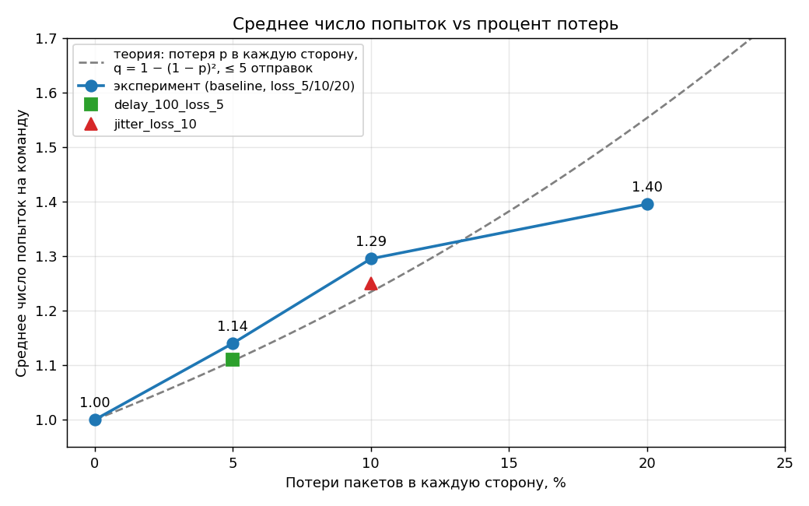
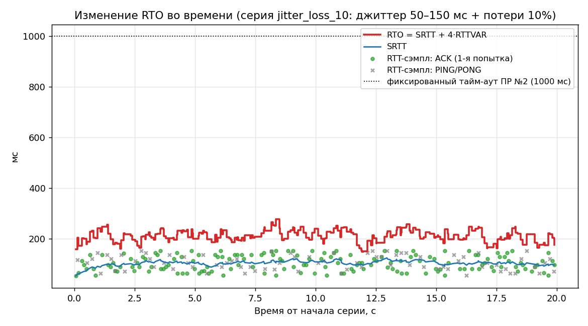

# Отчёт по надёжной доставке поверх UDP

ПР №3. Продолжает ПР №1 (игровые команды) и ПР №2 (телеметрия RTT/SRTT/джиттер):
поверх тех же модулей `protocol` и `telemetry` добавлен механизм подтверждений
(ACK), адаптивного тайм-аута (RTO) и повторной передачи для критичных команд.

## Состав команды

<!-- Заполните ФИО/роли участников. Ревьюер PR должен быть из команды (требование задания). -->
- _ФИО_ — _роль_

## Архитектура

### Модули

```
protocol/     — формат пакетов (версия 2): ACK, поле requiresAck, MOVEMENT/SHOOT
telemetry/    — из ПР №2: RTT/SRTT по PING/PONG (telemetry.*), сокет (transport.*)
reliability/  — НОВОЕ, без сокетов и без чтения часов:
  reliable_channel.*   ReliableChannel — учёт неподтверждённых пакетов, выдача
                       пакетов на повтор, перенос в failed_
  adaptive_timeout.*   AdaptiveTimeout — SRTT/RTTVAR/RTO (Jacobson/Karn)
  dedup_window.*       DedupWindow — окно уже обработанных номеров на сервере
client/reliable_client.cpp, server/reliable_server.cpp — «клей»: сокет + игровой цикл
```

`ReliableChannel` не знает ни о сокетах, ни о формате пакетов: время (`nowUs`) и
текущий RTO передаёт вызывающий код. Поэтому логику можно проверять
детерминированно, на виртуальном времени (`tests/test_reliable_channel.cpp`).

### Какие команды сделаны надёжными и почему

| Команда | `requiresAck` | Обоснование |
|---|:-:|---|
| `SHOOT` | 1 | Дискретное событие: потеря меняет исход боя, более свежий выстрел его не заменит |
| `MOVEMENT` | 0 | Позиция шлётся часто, каждый пакет делает предыдущий устаревшим. Повтор старой позиции бесполезен и может прийти позже новой |
| `PING`/`PONG` | 0 | Подтверждений не требуют (ПР №2): потеря PING — сама измеряемая величина |
| `ACK` | 0 | Всегда. ACK на ACK породил бы бесконечную цепочку |

Парсеры SHOOT/MOVEMENT принимают оба значения `requiresAck`, а PING/PONG/ACK с
`requiresAck = 1` отбрасывают как некорректные.

### Формат ACK и requiresAck

Заголовок (8 байт, big-endian): `packetType u8 | sequenceNumber u16 |
payloadSize u16 | protocolVersion u16 | requiresAck u8`. Версия протокола повышена
с 1 до 2, потому что заголовок стал на байт длиннее: пакеты версии 1 отбрасываются
на этапе `ReadHeader`. Полезная нагрузка ACK — только
`struct AckPayload { uint16_t acknowledgedSequence; }` (итого 10 байт).
Сериализация ручная (`WriteU8/WriteU16`, без `memcpy` структур), валидация длины,
версии, типа и `requiresAck` выполняется до чтения полей. Полная спецификация —
в `docs/Protocol_Specification.md`, приложение «Надёжная доставка».

### Алгоритм

1. Клиент отправляет `SHOOT` с `requiresAck = 1` и вызывает
   `ReliableChannel::OnSent(seq, rawBytes, now)`.
2. Сервер, получив пакет с `requiresAck = 1`, **сразу** отправляет ACK с тем же
   `sequenceNumber`, затем применяет эффект. Дубликат (номер уже в `DedupWindow`)
   эффект не применяет, но ACK отправляется снова (прежний ACK мог потеряться).
3. Клиент на ACK вызывает `OnAckReceived`: запись снимается, повторные и неизвестные
   ACK игнорируются без ошибки. Время до ACK идёт в `AdaptiveTimeout`.
4. Каждый такт цикла клиент вызывает `CollectForRetransmission(now, RTO)` и
   отправляет возвращённые пакеты повторно. Пакет возвращается не чаще, чем раз в RTO
   (отсчёт от **последней** отправки).
5. Если все `maxAttempts` (по умолчанию 5, **считая первую отправку**) использованы и
   ACK не пришёл за ещё один RTO, пакет переносится в `failed_`, а клиент пишет в
   лог событие уровня приложения «выстрел не подтверждён сервером».

### Формула RTO и константы

```
первый сэмпл:  SRTT = RTT,  RTTVAR = RTT / 2
далее:         RTTVAR = 0.75·RTTVAR + 0.25·|SRTT − RTT|     (по СТАРОМУ SRTT)
               SRTT   = 0.875·SRTT  + 0.125·RTT
RTO = clamp(SRTT + 4·RTTVAR, 100 мс, 3000 мс)
```

α = 1/8, β = 1/4 — константы RFC 6298. Отличия от кода из задания:

- до первого измерения RTO = 1000 мс (RFC 6298, п. 2.1). По формуле из задания он
  был бы 0 и поднялся бы до нижней границы 100 мс, то есть клиент слал бы ложные
  повторы ещё до первого RTT;
- сэмпл «время до ACK» учитывается **только для пакетов, подтверждённых с первой
  попытки** (правило Карелса): для повторно отправленного пакета неизвестно, на какую
  из отправок пришёл ACK, и такой сэмпл исказил бы RTT;
- источников сэмплов два: PING/PONG (`telemetry::Telemetry`, ПР №2) и ACK на SHOOT.

### Дедупликация на сервере

`DedupWindow` хранит 1024 последних обработанных `sequenceNumber` (FIFO-вытеснение).
Копия пакета может прийти после потери ACK или если RTO клиента сработал раньше ACK.
Предельный возраст копии — около `maxAttempts · maxRTO` = 5 · 3 с = 15 с, то есть
≈150 SHOOT при 10 командах/с, поэтому окно с большим запасом перекрывает его. Ограничение:
копия, пришедшая после вытеснения своего номера из окна, была бы принята за новую.

## Методика эксперимента

- Среда: Linux-песочница (Ubuntu 24.04, g++ 13.3, `-std=c++17 -O2`), локальная петля
  `127.0.0.1:27017`. Код кросс-платформенный; сборка под Windows проверена
  MinGW-w64 (`x86_64-w64-mingw32-g++`), но **сам эксперимент на Windows не запускался**.
- Нагрузка: **200 команд SHOOT на серию** (минимум по заданию — 50), интервал 100 мс, плюс
  PING каждые 200 мс для RTT-сэмплов, `maxAttempts = 5`.
- Clumsy доступен только под Windows, поэтому, как и в ПР №2, эмуляция встроена в сервер
  (флаги `--delay-ms`, `--jitter-min-ms/--jitter-max-ms`, `--loss-percent`, `--seed`);
  это допускается заданием, но фиксируется здесь явно.
- Потери применяются **независимо в каждую сторону**: к входящим пакетам клиент → сервер
  и к исходящим ACK/PONG сервер → клиент. Именно потеря ACK порождает дубликаты на сервере.
- Задержка не блокирует приём (ответы ставятся в очередь), поэтому при джиттере ответы
  могут переупорядочиваться.
- Seed сервера: `200001…200007` (`run_reliability_experiments.sh`), прогон воспроизводим.
  Серии, отличающиеся только seed'ом, дают те же потери: недоставленная команда в
  `jitter_loss_10` (seq 107) оказалась одной и той же в двух независимых прогонах.
- Вспомогательные серии (сверх обязательных шести): `cmp_fixed1000_…` и `cmp_fixed100_…`
  (те же условия и seed, что у `delay_100_loss_5`, но постоянный RTO) и
  `extra_loss_20_max2` (потери 20 %, `maxAttempts = 2`, для демонстрации failed).

Воспроизведение: `run_reliability_experiments.sh` или `.ps1`, затем
`python3 analysis/analyze_reliability.py`.

## Результаты

| Серия | Отправлено | Доставлено с 1-й попытки | Retransmit total | Failed | Avg attempts | Avg RTO, мс | Final RTO, мс | Time-to-ACK, мс (средн./медиана/макс.) |
|---|---:|---:|---:|---:|---:|---:|---:|---:|
| baseline | 200 | 200 (100.0%) | 0 | 0 (0.0%) | 1.000 | 100.0 | 100.0 | 0.12 / 0.10 / 1.69 |
| loss_5 | 200 | 174 (87.0%) | 28 | 0 (0.0%) | 1.140 | 100.0 | 100.0 | 14.68 / 0.11 / 208.10 |
| loss_10 | 200 | 149 (74.5%) | 59 | 0 (0.0%) | 1.295 | 100.0 | 100.0 | 30.81 / 0.12 / 312.16 |
| loss_20 | 200 | 144 (72.0%) | 79 | 0 (0.0%) | 1.395 | 100.0 | 100.0 | 41.18 / 0.12 / 416.02 |
| delay_100_loss_5 | 200 | 178 (89.0%) | 22 | 0 (0.0%) | 1.110 | 109.8 | 104.5 | 116.05 / 104.05 / 224.02 |
| jitter_loss_10 | 200 | 159 (79.5%) | 50 | 1 (0.5%) | 1.250 | 210.7 | 175.9 | 154.18 / 119.99 / 552.04 |

«Final RTO» — значение в момент последнего сэмпла серии, «Avg RTO» — среднее по
RTO на момент разрешения каждой команды (подтверждения или недоставки).
В сериях без задержки (baseline, loss_*) RTT на петле ≈ 0.1 мс, и RTO всё время упирается
в нижнюю границу 100 мс — это и есть RTO 100 мс.

Серверная сторона (по `docs/server_rel_<серия>.log`):

| Серия | Эффектов применено | Дубликатов отброшено окном | Подтверждено клиентом | Failed у клиента, но применено сервером |
|---|---:|---:|---:|---:|
| baseline | 200 | 0 | 200 | 0 |
| loss_5 | 200 | 12 | 200 | 0 |
| loss_10 | 200 | 30 | 200 | 0 |
| loss_20 | 200 | 35 | 200 | 0 |
| delay_100_loss_5 | 200 | 16 | 200 | 0 |
| jitter_loss_10 | 200 | 18 | 199 | 1 |

Номинальный процент потерь — вероятность на каждое направление, а реальная выборка
конечна. Фактическая доля по логам сервера:

| Серия | Номинал, % | SHOOT потеряно на пути к серверу | ACK потеряно на пути к клиенту |
|---|---:|---:|---:|
| loss_5 | 5 | 16 из 228 (7.0%) | 12 из 212 (5.7%) |
| loss_10 | 10 | 29 из 259 (11.2%) | 30 из 230 (13.0%) |
| loss_20 | 20 | 44 из 279 (15.8%) | 35 из 235 (14.9%) |
| delay_100_loss_5 | 5 | 6 из 222 (2.7%) | 15 из 216 (6.9%) |
| jitter_loss_10 | 10 | 32 из 250 (12.8%) | 19 из 218 (8.7%) |

Сравнение адаптивного и фиксированного RTO (условия `delay_100_loss_5`, один seed):

| Вариант RTO | Доставлено с 1-й попытки | Retransmit total | Дубликатов на сервере | Avg attempts | Time-to-ACK, мс (средн./макс.) |
|---|---:|---:|---:|---:|---:|
| адаптивный | 178 (89.0%) | 22 | 16 | 1.110 | 116.05 / 224.02 |
| фиксированный 1000 мс | 181 (90.5%) | 22 | 14 | 1.110 | 214.34 / 2119.97 |
| фиксированный 100 мс | 82 (41.0%) | 129 | 116 | 1.645 | 116.53 / 312.32 |

Демонстрация окончательной недоставки (`extra_loss_20_max2`: потери 20 %, `maxAttempts = 2`):

| Отправлено | Подтверждено | Failed | Failed, но эффект применён сервером | Failed, эффект НЕ дошёл до сервера |
|---:|---:|---:|---:|---:|
| 200 | 173 | 27 (13.5%) | 20 | 7 |

## Графики

- Среднее число попыток vs процент потерь: `docs/graphs/attempts_vs_loss.png`

  

- Изменение RTO во времени (серия `jitter_loss_10`): `docs/graphs/rto_over_time.png`

  

## Анализ

**Как адаптивный RTO ведёт себя при росте задержки по сравнению с фиксированным
тайм-аутом из ПР №2?** В `delay_100_loss_5` RTT ≈ 104 мс. Первый сэмпл дал RTO ≈ 302 мс
(3·RTT), затем RTTVAR затух, и RTO сошёлся к ≈ 104.5 мс (диапазон 104–302 мс). Результат
по сравнению с постоянными значениями:

- фиксированные 1000 мс избыточны: те же 22 повтора, но потерянный пакет ждёт целую секунду,
  а при повторной потере — две; максимум времени до ACK 2120 мс против 224 мс, среднее 214 мс
  против 116 мс;
- фиксированные 100 мс меньше реального RTT: тайм-аут срабатывает до прихода ACK, и
  41 % команд уходят с первой попытки против 89 %, повторов 129 вместо 22, а сервер получает
  116 дубликатов вместо 16. Такой RTO ложно считает потерянным каждый живой пакет;
- адаптивный RTO даёт те же 22 повтора, что и 1000 мс (то есть ложных повторов нет: все они
  вызваны реальными потерями), и ту же скорость реакции, что и 100 мс на коротком канале.

В `jitter_loss_10` (RTT 52–152 мс) RTO колеблется в диапазоне 148–278 мс (среднее 211 мс):
большая RTTVAR (в среднем 27 мс) удерживает RTO примерно на 40–170 мс выше SRTT (≈ 104 мс).
Фиксированные 100 мс были бы ниже RTT, достигающего 152 мс, и вызывали бы ложные повторы
(эта комбинация отдельно не измерялась), а 1000 мс давали бы лишнее ожидание после каждой потери.

Ограничение метода: в `delay_100_loss_5` RTTVAR → 0, и запас RTO над RTT сжимается до
долей миллисекунды. На петле с эмулированной постоянной задержкой это не привело к ложным
повторам: 22 повтора = 6 потерянных SHOOT + 16 потерянных ACK, а 16 дубликатов на сервере
соответствуют потерянным ACK. В реальной сети с шумом RTTVAR до нуля не затухает.
Нижняя граница 100 мс при RTT ≈ 0.1 мс (baseline, loss_*) — наоборот, избыточна: потерянный
пакет ждёт 100 мс вместо нескольких миллисекунд. Это цена защиты от ложных повторов; для
файтинга 100 мс на повтор выстрела допустимы.

**Что произошло с пакетами в серии loss_20 — сколько ушло в failed и почему?** В failed ушло
0 из 200: при 5 попытках вероятность недоставки команды — q⁵, где q = 1 − (1 − p)² —
вероятность, что потерян либо пакет, либо ACK. Для номинальных 20 % q = 0.36 и q⁵ = 0.6 %
(≈ 1.2 команды из 200); для фактических ≈ 15 % (см. таблицу выше) q = 0.28 и q⁵ = 0.16 %
(≈ 0.3 команды). Отсутствие failed не противоречит оценке, но не доказывает, что их не бывает:
в `jitter_loss_10` одна команда (seq 107) исчерпала все 5 попыток. Самая
«упорная» команда в `loss_20` потребовала ровно 5 попыток (1 случай), 3 команды — 4, 14 — 3.
Среднее число попыток 1.395 соответствует кривой 1 + q + q² + q³ + q⁴ при фактической потере ≈ 15 %
(≈ 1.38), а при номинальных 20 % теория дала бы 1.55 (график `attempts_vs_loss.png`).
При `maxAttempts = 2` (`extra_loss_20_max2`) в failed ушло 13.5 % (теория для q² = 0.36² = 13 %).

Failed означает «клиент не получил ACK», а не «выстрел не дошёл»: из 27 failed в
`extra_loss_20_max2` 20 команд сервер применил (потерялись все ACK), 7 действительно не
дошли. Аналогично seq 107 в `jitter_loss_10`: сервер применил выстрел, но оба его
ACK потерялись. Игра должна учитывать эту неоднозначность: транспорт сообщает
«не подтверждено», а не «не произошло».

**Как окно дедупликации на сервере предотвращает повторное применение эффекта команды?**
Сервер ведёт `DedupWindow` из 1024 последних `sequenceNumber`. На каждую копию
отправляется ACK, но `MarkProcessed(seq)` возвращает `true` только при первом появлении
номера. Во всех сериях сервер применил ровно 200 эффектов на 200 команд при 12–35
дубликатах на серию; `analyze_reliability.py` проверяет по логам, что ни один номер не
применён дважды. Тот же инвариант проверен в тестах симуляции.

## Вывод

Реализован надёжный канал для критичной команды SHOOT: ACK/`requiresAck` в протоколе
версии 2, `ReliableChannel` без сетевого ввода-вывода, адаптивный RTO по Jacobson/Karn
на основе RTT из ПР №2 и сэмплов ACK, ограничение попыток с фиксацией окончательной
недоставки и дедупликация на сервере. На эксперименте с потерями 5–20 % все команды,
кроме одной (jitter_loss_10), были подтверждены, ни один эффект не применён дважды. Среднее
число попыток растёт от 1.00 до 1.40 при потерях 0–20 % и согласуется с моделью
независимых потерь пакета и ACK. В сравнении при задержке 100 мс адаптивный RTO не дал ни
ложных повторов (как фиксированные 100 мс), ни лишнего ожидания (как фиксированные 1000 мс).

Ограничения: эксперимент проведён на локальной петле с эмуляцией потерь в сервере (не
на Windows и не на реальной сети), выборка 200 команд на серию мала для редких событий
(failed), а у `loss_*` фактическая доля потерь отклоняется от номинала на несколько
процентных пунктов.

## Ответы на вопросы для защиты

1. **Почему фиксированный тайм-аут из ПР №2 непригоден для повторной передачи?** Он нужен,
   чтобы отделить «ответ не придёт» от «ответ пришёл поздно» при измерении, и не зависит
   от текущего RTT: при RTT 0.1 мс потерянный пакет ждёт секунду, при RTT около 1.2 с вызывает
   ложные повторы (см. сравнение 1000 мс и 100 мс выше).
2. **Как считается RTTVAR и почему множитель 4?** RTTVAR — сглаженное среднее отклонение
   `|SRTT − RTT|` с β = 1/4. Среднее абсолютное отклонение меньше стандартного (для
   нормального распределения примерно в 1.25 раза), а нужен запас, покрывающий почти все
   нормальные колебания RTT; множитель 4 (выбор RFC 6298) даёт такой запас, при множителе 1
   заметная доля нормальных ответов приходила бы позже RTO и вызывала ложные повторы.
3. **Почему ACK не порождает ACK на ACK?** У ACK `requiresAck = 0`, а парсер отбрасывает
   ACK с `requiresAck = 1`. Потерю ACK компенсирует повтор исходного пакета.
4. **Как сервер отличает копию от нового пакета?** По `sequenceNumber`: новая команда
   получает новый номер от счётчика клиента, копия — прежний; номер ищется в `DedupWindow`.
5. **Что должно произойти в игре, если SHOOT окончательно не доставлен?** Клиент получает
   событие «выстрел не подтверждён» и решает на уровне игры: например, откатить
   предсказанный локально эффект или показать индикатор потери связи. Транспорт не знает,
   применил ли сервер выстрел (см. анализ failed выше), поэтому состояние следует сверять по
   снимкам мира.
6. **Почему не все команды надёжные?** Для MOVEMENT повтор устаревшей позиции бесполезен, а
   ожидание ACK и очередь повторов добавили бы задержку и нагрузку: следующий пакет приходит
   через 10–50 мс.
7. **Как связаны результаты ПР №2 и параметры повторной передачи?** RTT/SRTT из ПР №2
   напрямую питают `AdaptiveTimeout` (источник сэмплов «ping»), а джиттер определяет RTTVAR:
   чем больше разброс RTT (серия `jitter_loss_10`), тем дальше RTO от SRTT.
